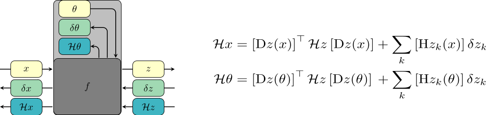

> :information_source: The exact matrix-free curvature products are integrated into [BackPACK](https://github.com/f-dangel/backpack) - easier to use and support more layers. Check it out at [`backpack.extensions.curvmatprod`](https://github.com/f-dangel/backpack/tree/master/backpack/extensions/curvmatprod)! :information_source:

This repository contains a PyTorch implementation of the **Hessian backpropagation (HBP)** framework, along with the experiments, presented in

> **Modular Block-diagonal Curvature Approximations for Feedforward Architectures**<br/>
> F. Dangel, S. Harmeling, and P. Hennig<br/>
> [https://arxiv.org/abs/1902.01813](https://arxiv.org/abs/1902.01813)

<p align="center">

</p>

# Reproduce the experiments

- Get the repository
  ```bash
  git clone https://github.com/f-dangel/hbp.git
  cd hbp
  ```
- Install dependencies
  ```bash
  # Alternative 1: Anaconda
  make conda-env
  conda activate hbp-experiments

  # Alternative 2: pip
  make install
  ```
- Run the script
  * Reproduce figures from the original data
  ```bash
  # original figures
  bash reproduce.sh --original
  ```
  * Run experiments on your machine and generate figures
  ```bash
  # experiments on your machine
  bash reproduce.sh
  ```
  * You can remove existing runs and figures to start over
  ```bash
  # remove existing runs/figures
  make clean
  ```
- Figures are saved to `./fig`.

**TL;DR**

# (Optional) Verify installation
- Check the Hessian backpropagation library:
  ```
  make test
  ```
- Run tests on the experiment utilities:
  ```
  make test-exp
  ```

# Details

## Repository structure

* [bpexts](bpexts): Backpropagation extensions. Implements the two strategies presented in the paper to obtain approximate curvature information. Feedforward (fully-connected and convolutional) neural networks are supported.

  * [bpexts.hbp](bpexts/hbp): Backpropagation of batch-averaged loss Hessian

  * [bpexts.cvp](bpexts/cvp): Exact curvature matrix-vector products (Hessian, GGN, PCH)

  * [bpexts.optim](bpexts/optim): Implementation of conjugate gradient and Newton-style optimizer

* [exp](exp): Experiments, data loading, training loops and logging

* [scripts](scripts): Scripts to run subset of experiments and create figures 

* [examples](examples): Basic examples on how to use the code

## Using the code

* Basic tutorials

  * [Second-order optimization with HBP for a single layer on MNIST](examples/01_hbp_single_layer_mnist.py)

  * [Second-order optimization with HBP for a sequential model on CIFAR-10](examples/02_hbp_sequential_cifar10.py)
